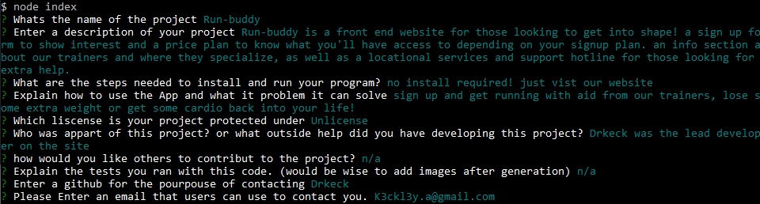
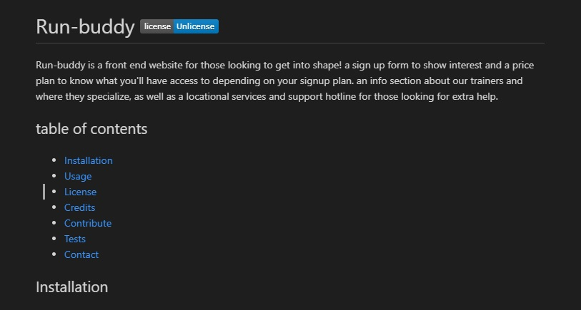

  # README Geneorator
  
Welcome to my very own readme generator, i wanted to establish a polished / professional look. It took a few itterations to get everything right, and even with that i had to cut some things out.I personally think it turned out great and would like to continue to work on it.

  ## Table of contents
  * [Installation](#installation)
  * [Usage](#usage)
  * [Contact](#contact)
  ## Installation

Download from github or clone the repository!

Once you have it downloaded or cloned

Open the repo in gitbash andEnter :

    npm install

After npm installs depent packages run the app using :

    node index.js 

## Usage 

Enter all Relevent information to your project!

Many of the questions are geared twoard how you can present your project if you don't already have an idea.

after you fill out all the info a README will be created in the completed folder with all the info you provided!

feel free to add pictures and videos to the README to give it a litte more visual flare!

## Contact
Contact [Drkeck](https://www.github.com/drkeck) if you have any questions,
or you can contact me by [Email.](k3ck3ly.a@gmail.com)
